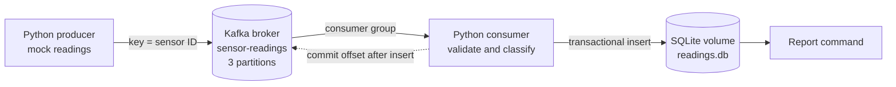

# Kafka sensor event pipeline

A small distributed system that generates mock temperature and humidity readings, sends them through Apache Kafka, and stores processed results in SQLite. It demonstrates a producer, broker, consumer group, keyed partition ordering, at-least-once delivery, and replay-safe storage.

## Architecture



The producer and consumer run in separate containers and communicate only through Kafka. Events with the same sensor ID use the same Kafka key, so Kafka preserves their order **within that partition**. Other sensors can be processed independently. This demo runs one consumer instance; adding consumers to the same group lets Kafka distribute the three partitions.

Each event contains `event_id` (UUID), `sensor_id`, `observed_at` (UTC ISO 8601), `temperature_c`, and `humidity_pct`. The consumer marks an event `ALERT` when temperature is at least 35 C or humidity is at least 80%; otherwise it marks it `NORMAL`.

## Run the project

Prerequisites: Docker Engine with the Compose plugin. From this repository:

```bash
docker compose up -d --build kafka init-topic consumer
docker compose run --rm producer --count 20 --interval 0.2 --sensors 3
docker compose exec consumer python -m sensor_pipeline.report --limit 20
```

The final command prints the latest readings and totals by status. Follow live processing with `docker compose logs -f consumer`. Run the producer again to generate more readings. Stop with `docker compose down`; data remains in named volumes. Use `docker compose down -v` to reset Kafka and SQLite data.

Kafka's host listener is `localhost:29092`; containers use `kafka:19092`. The host listener binds to loopback because the local demo does not configure authentication or TLS. Do not expose it directly on a public interface.

### Example output

```text
2026-10-04T15:42:12.000000+00:00 sensor-01   39.2 C  56.0% ALERT  p=1 o=4
2026-10-04T15:42:11.000000+00:00 sensor-03   24.1 C  47.0% NORMAL p=0 o=2
total=20 alert=7 normal=13
```

Values, partition numbers, offsets, and counts vary on each run.

## Delivery and failure behavior

The producer enables Kafka idempotence and waits for broker acknowledgements before exiting. The consumer disables automatic commits. For each record it validates the JSON and Kafka key, inserts it in a SQLite transaction, then synchronously commits the Kafka offset. If it crashes between the insert and commit, Kafka may redeliver the record; the `event_id` and topic/partition/offset uniqueness constraints prevent a second row. This gives **at-least-once delivery with idempotent storage**, not end-to-end exactly-once delivery.

Malformed records stop the consumer and leave their offsets uncommitted, so they are visible for investigation instead of silently disappearing. For a production service, add a dead-letter topic, monitoring, and a replicated database. This single-broker Compose setup is intentionally a local deployment demonstration, not a fault-tolerant Kafka cluster.

## Tests and CI

Run the unit tests locally:

```bash
python3 -m venv .venv
. .venv/bin/activate
pip install -r requirements-dev.txt
python -m pytest -q
docker compose config -q
```

The suite covers event serialization, validation, alert boundaries, replay deduplication, and key checks. [GitHub Actions](.github/workflows/ci.yml) runs the tests and a real Docker Compose round trip on each push and pull request. To reject a local push when tests fail, install the included hook once:

```bash
git config core.hooksPath .githooks
```

For remote enforcement, protect `main` in GitHub repository settings and require the **CI / test** status check before merging. GitHub Actions alone reports a failed push; it cannot undo a push that already happened. Use pull requests for changes to protected `main`.

## Short presentation outline (2-3 minutes)

1. **Problem and architecture (30 seconds):** Sensors emit readings independently. The producer publishes JSON records to Kafka; the consumer processes them asynchronously and stores them in SQLite.
2. **Distributed behavior (45 seconds):** Show the three-partition topic and explain that the sensor ID is the Kafka key. Ordering is guaranteed per sensor within a partition. The producer and consumer can run and restart separately.
3. **Reliability (45 seconds):** Explain the insert-then-commit order, possible replay, and how unique keys keep the result correct. Mention that one broker is for demonstration.
4. **Live demo (45 seconds):** Run `docker compose run --rm producer --count 5 --interval 0`, then `docker compose exec consumer python -m sensor_pipeline.report`. Show the new rows and alert count.

## References

- [Apache Kafka Docker image and Compose examples](https://github.com/apache/kafka/blob/trunk/docker/examples/README.md)
- [Confluent Python client: producer flushing and manual consumer commits](https://docs.confluent.io/kafka-clients/python/current/overview.html)
